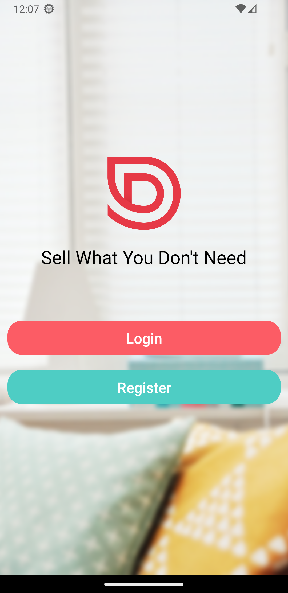
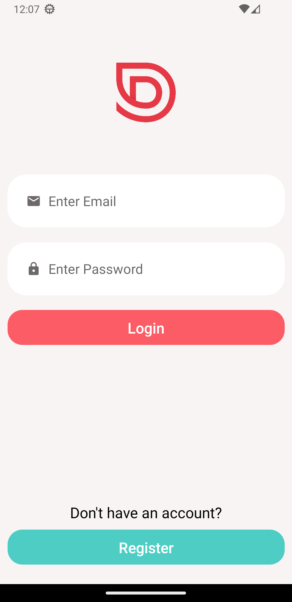
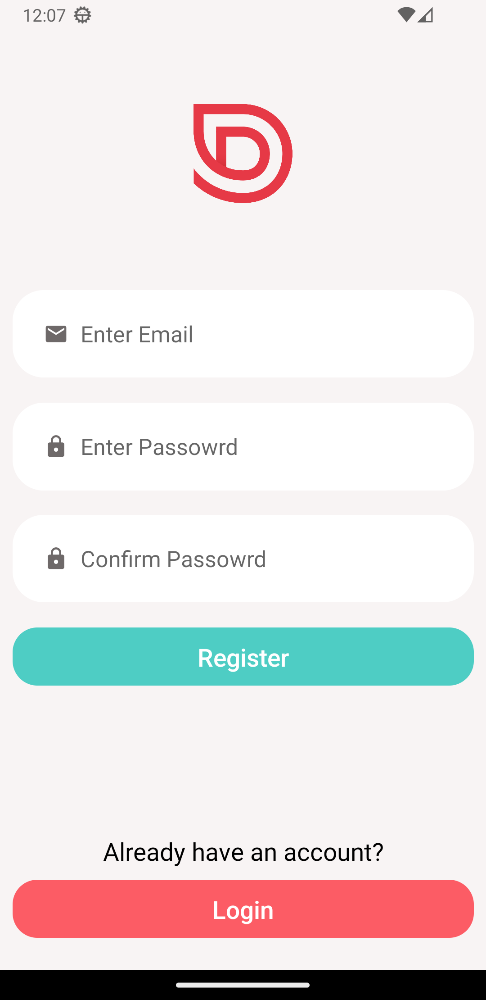
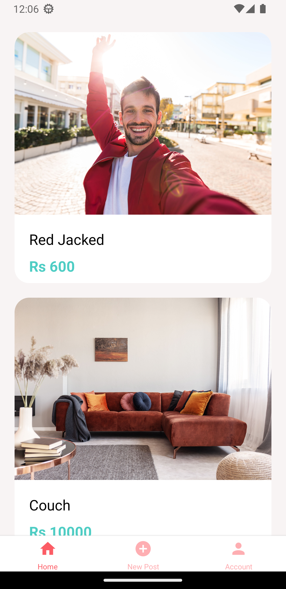
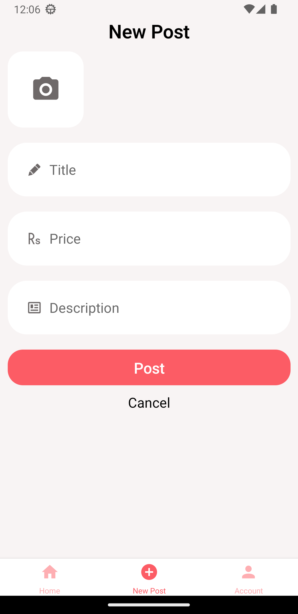
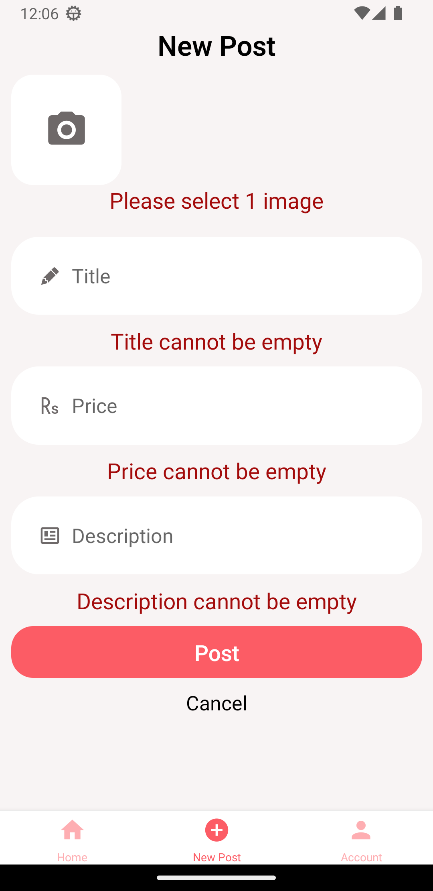
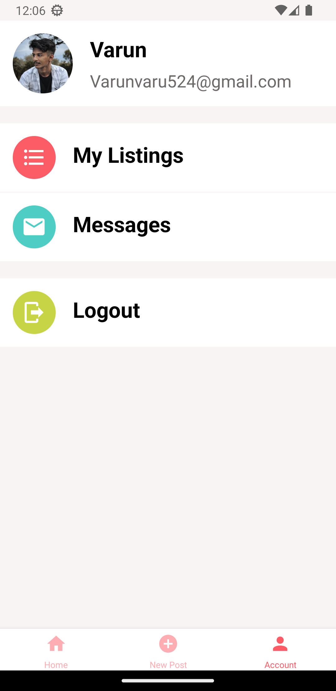
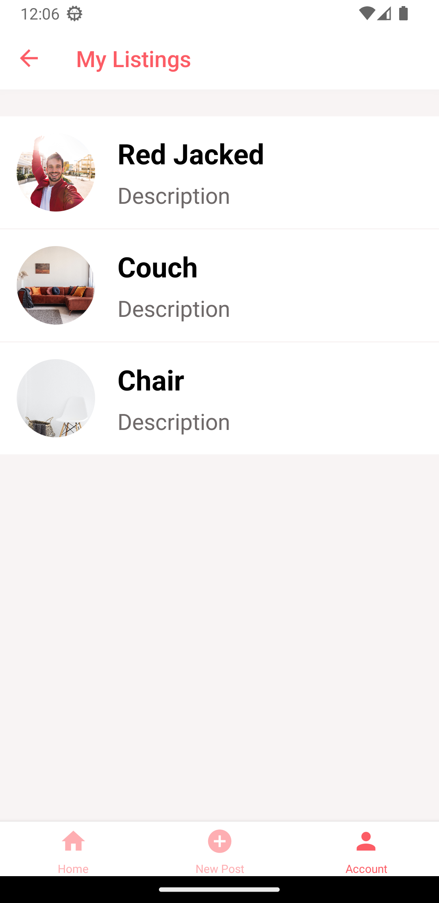
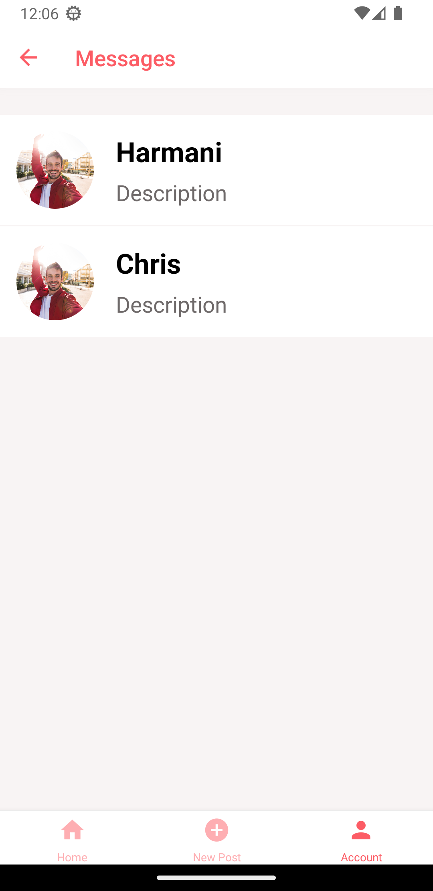

# Done With It

> Done with it is a market place where you can buy and sell second-hand goods!. This platform provides a convenient way for users to browse through a range of pre-owned items, from electronics to clothing and accessories. 

Done with it is only the front end application built with react native.

# View the live app
Before clicking the below links first you should install the expo go app from the [Playstore](https://play.google.com/store/apps/details?id=host.exp.exponent&hl=en&gl=US) or [App store](https://apps.apple.com/us/app/expo-go/id982107779).

For ios - [Click here](exp://u.expo.dev/update/f990b740-1323-478c-bb06-b97f74e457ba)

For Android - [Click here](exp://u.expo.dev/update/b48f4f73-7c4b-49a5-831b-37af80c85f6f)

# Screenshots

<h3>Welcome screen</h3>

<h3>Login screen</h3>

<h3>Register screen</h3>

<h3>Feed Screen</h3>

<h3>New Post Screen</h3>

<h3>New Post Validation</h3>

<h3>Account screen</h3>

<h3>My Listings screen</h3>

<h3>Messages Screen</h3>

# Features

+ Login and logout
+ Feed Screen
+ Posting a new post
+ Messages screen
+ My listings screen
+ Product details screen
+ Tab and stack navigation

# Technologies Used

+ React native - To build cross platform application
+ Expo - For easy managemant
+ React navigation - For navigation
+ Secure storage - For storing auth tokens
+ Lottie - For animations

# Local Setup

Fork and clone this repository on your local machine with the command

    git clone https://github.com/Varunvaru524/Done-With-It

## Install Dependencies
To install all the dependencies which is required to run the application

    npm i

## Start
To start the react native app locally

    npm start

## Running the app in mobile
After the command `npm start`, metro bundler will give you a QR code. If you scan the QR it will download the expo go app from [Playstore](https://play.google.com/store/apps/details?id=host.exp.exponent&hl=en&gl=US) or [App store](https://apps.apple.com/us/app/expo-go/id982107779) which helps to connect and run the app locally only if both the devices ( Laptop and Mobile phone ) are connected to the same local network.

## To run in android emulator
Please refer - https://docs.expo.dev/workflow/android-studio-emulator/

## To run in ios simulator
Please refer - https://docs.expo.dev/workflow/ios-simulator/

